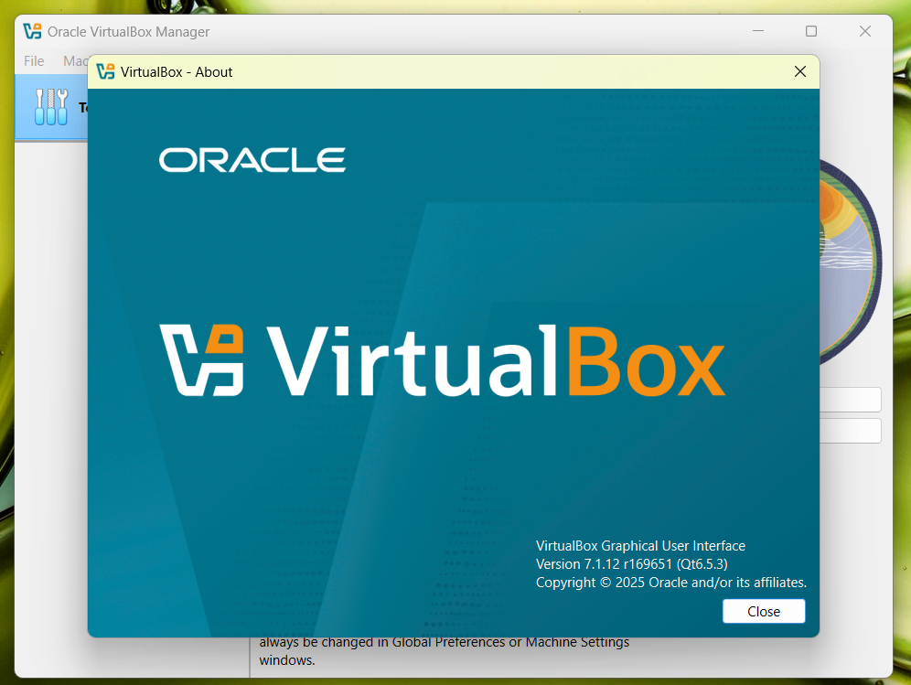
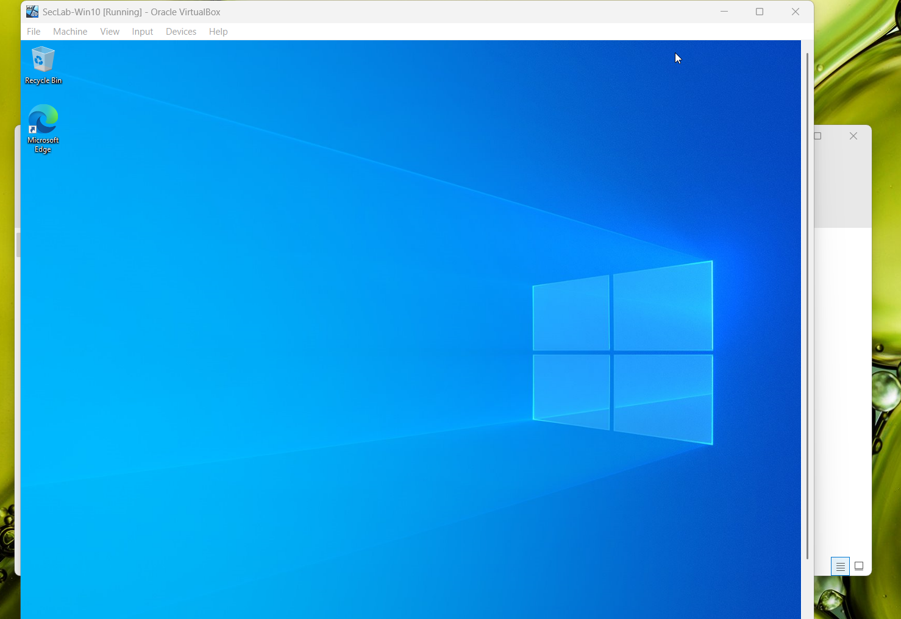
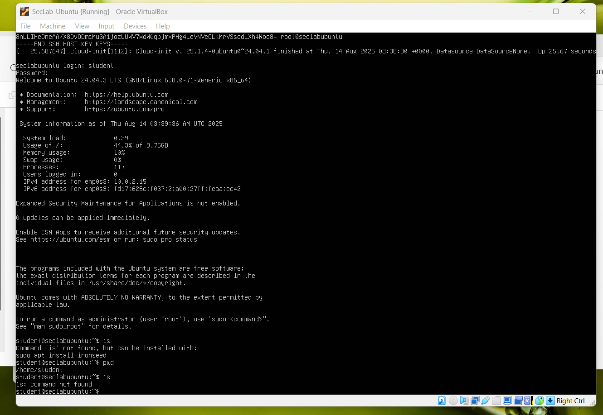
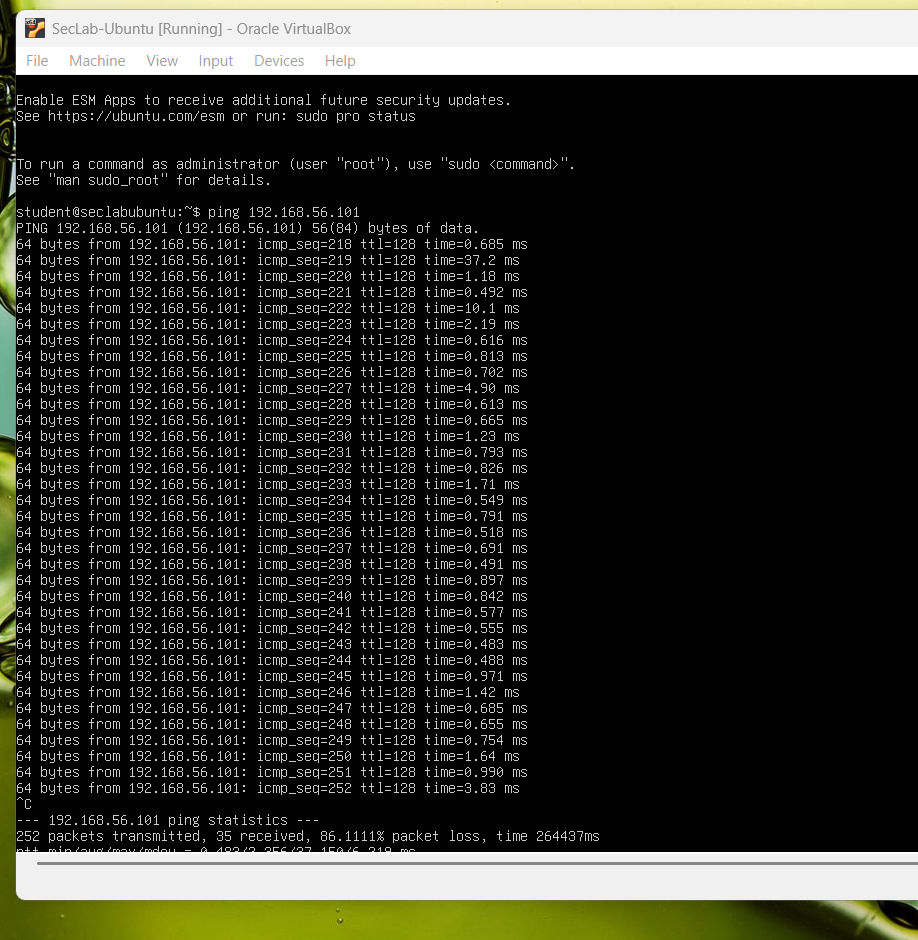
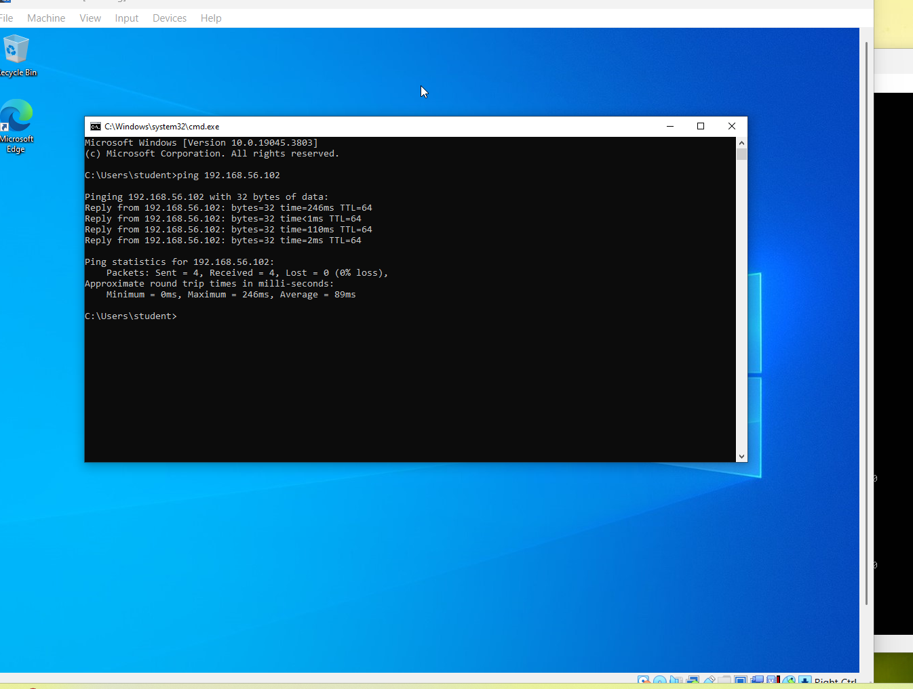

# Lab Setup - Section 1: Homelab Setup

## Summary
Set up a fully functional cybersecurity homelab with Windows and Linux VMs on Oracle VirtualBox.
Configured networking for internet access and isolated lab communication.

## VirtualBox Configuration
- **Windows 10 VM:** 4 GB Ram, 2 cores, 50 GB VDI
- **Ubuntu Server VM:** 2 GB RAM, 2 cores, 25 GB VDI

## Proof Screenshots

