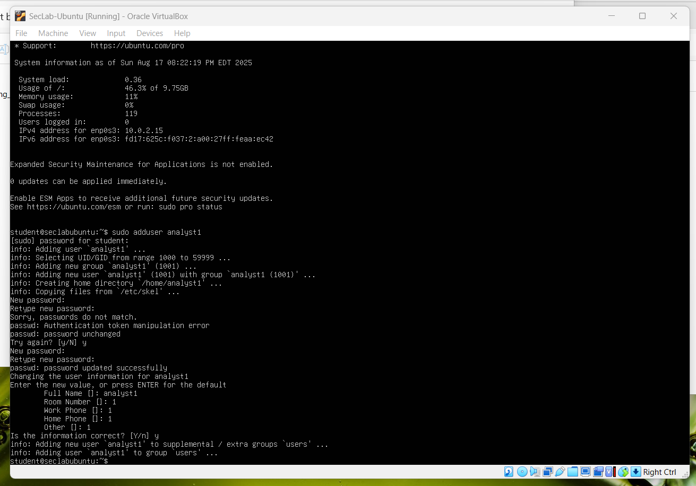
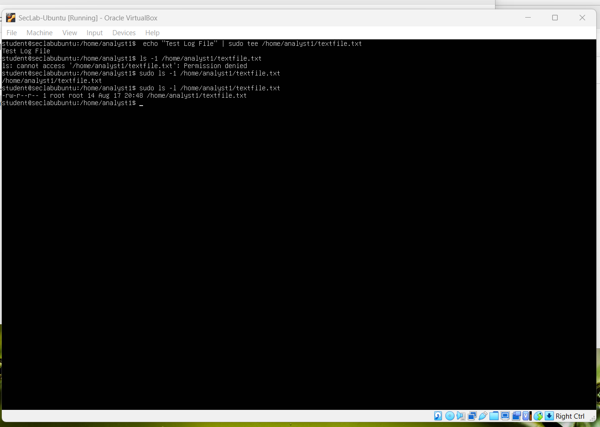
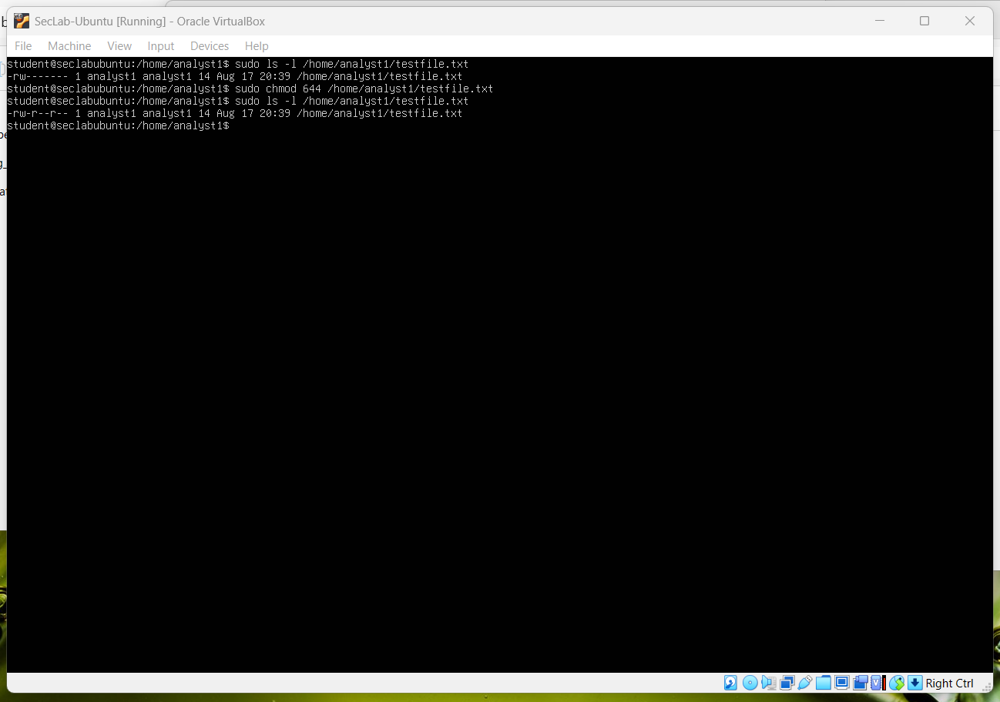
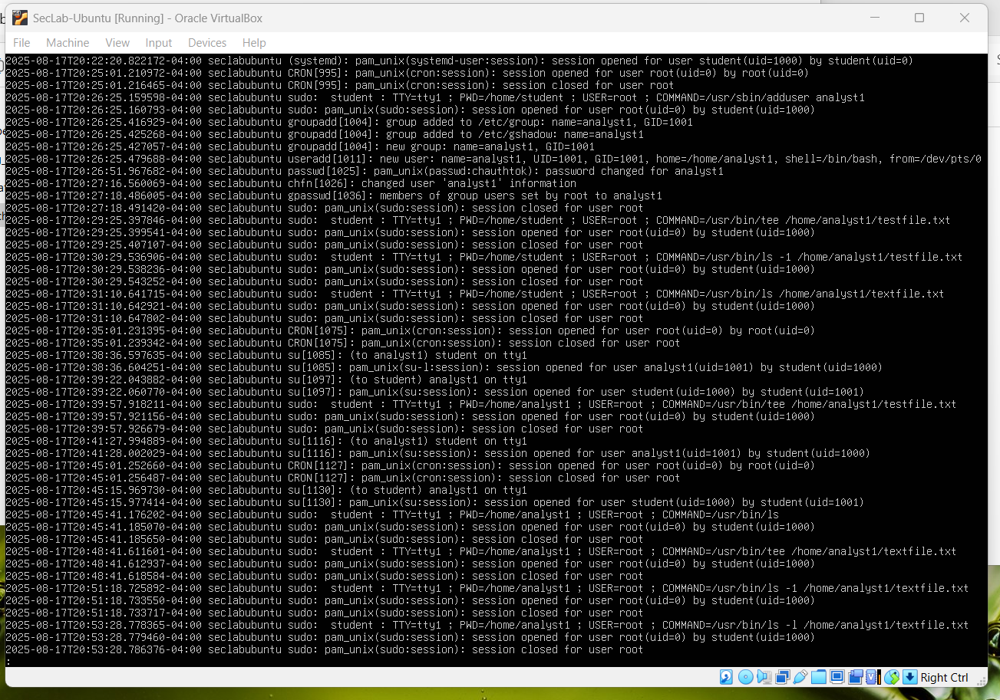

# Command Log - Section 2: Linux Fundamentals for Security Pros

---

## 1) Create a new analyst user
```bash
sudo adduser analyst1
```


---

## 2) Create a file and view it's permissions
``` bash
echo "Test log file" | sudo tee /home/analyst1/testfile.txt
sudo ls -l /home/analyst1/testfile.txt
```


---

## 3) Change permissions and verify
``` bash
sudo chmod 600 /home/analyst1/testfile.txt
sudo ls -l /home/analyst1/testfile.txt
sudo chmod 644 /home/analyst1/testfile.txt
sudo ls -l /home/analyst1/testfile.txt
```


---

## 4) View authentication log
``` bash
sudo less /var/log/auth.log
```


---

## 5) View System Log
``` bash
sudo less /var/log/syslog
```


---

## Environment
- Ubuntu Server LTS VM (VirtualBox, NAT + Host-only)
- All commands executed as admin user with sudo privileges