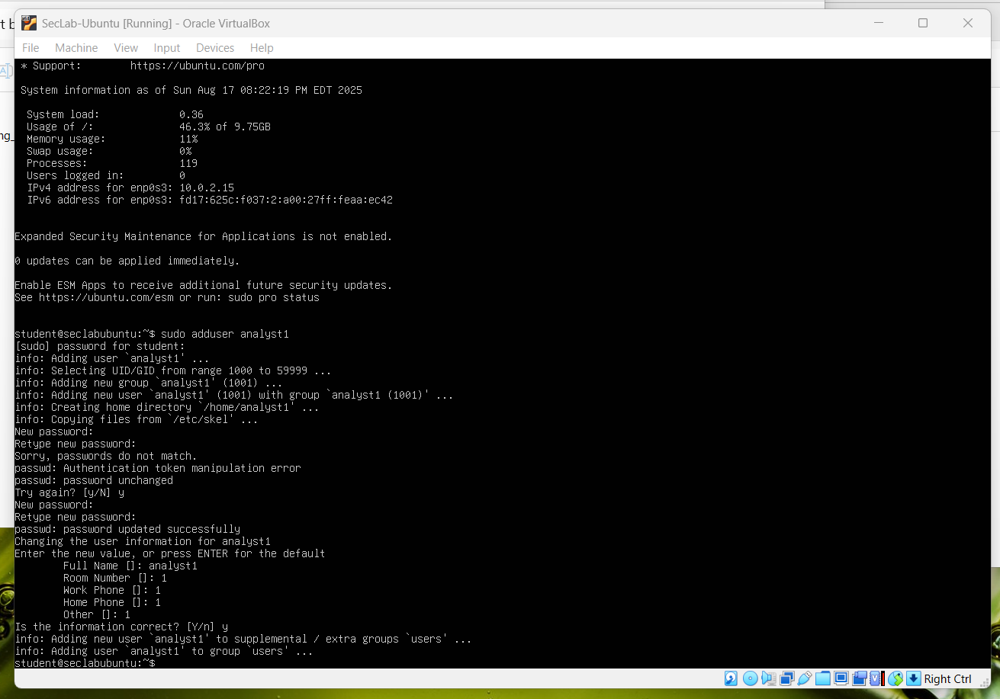
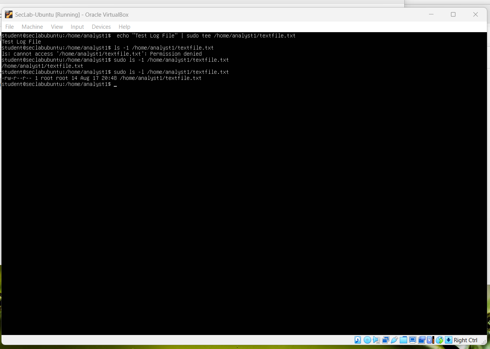
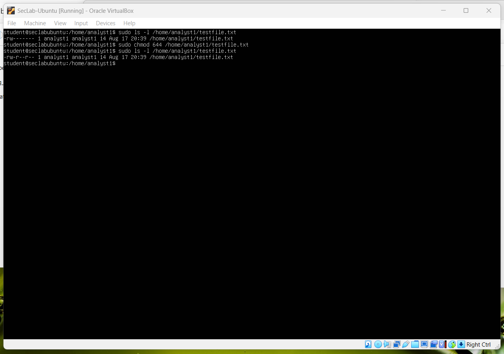
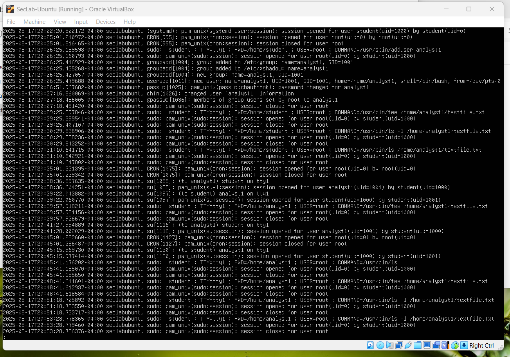
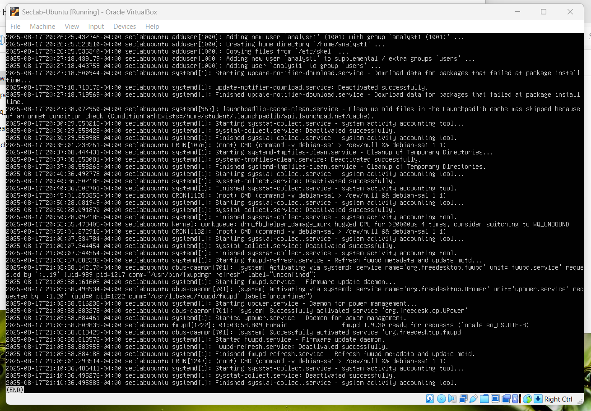

# Lab Setup - Section 2

This lab demonstrates foundation Linux administration relevant to security: creating a least-privilege user, enforcing permissions, and reviewing logs for activity and evidence.

## Proof Screenshots
- 
- 
- 
- 
- 
- 