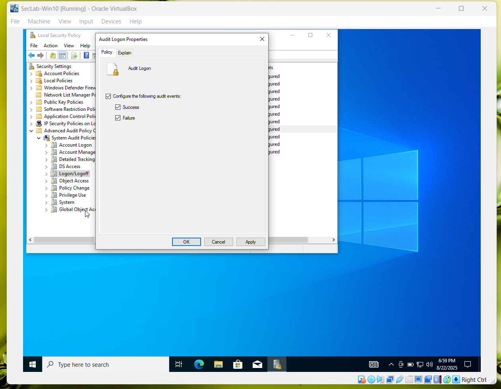
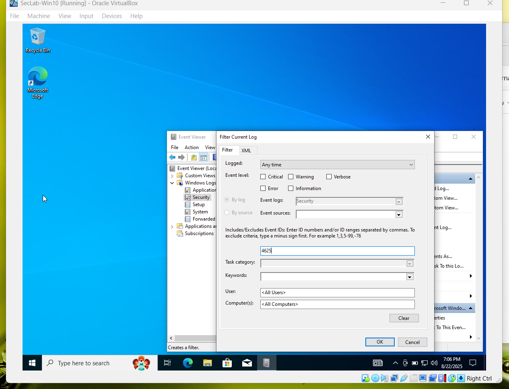
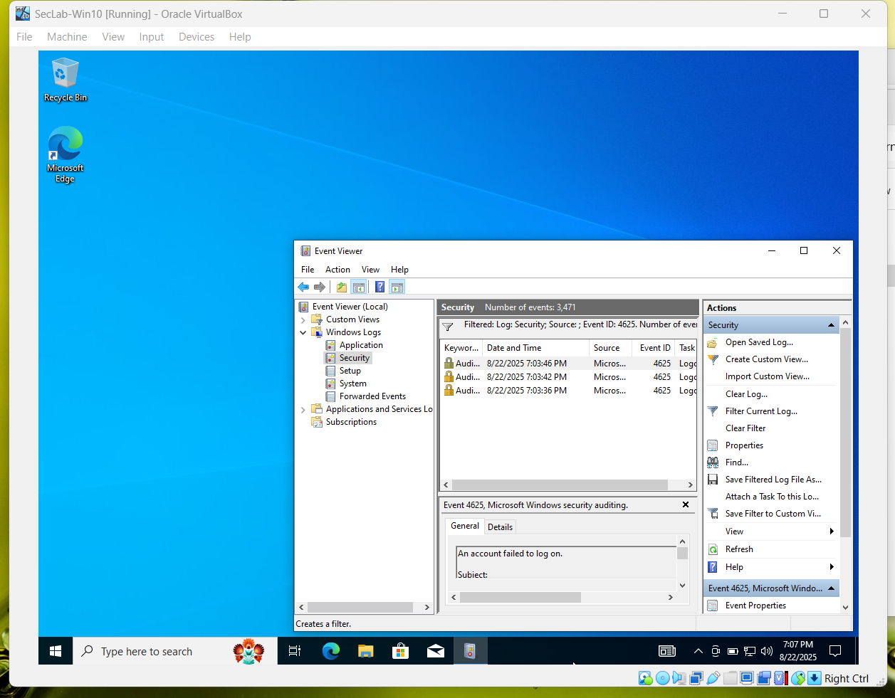
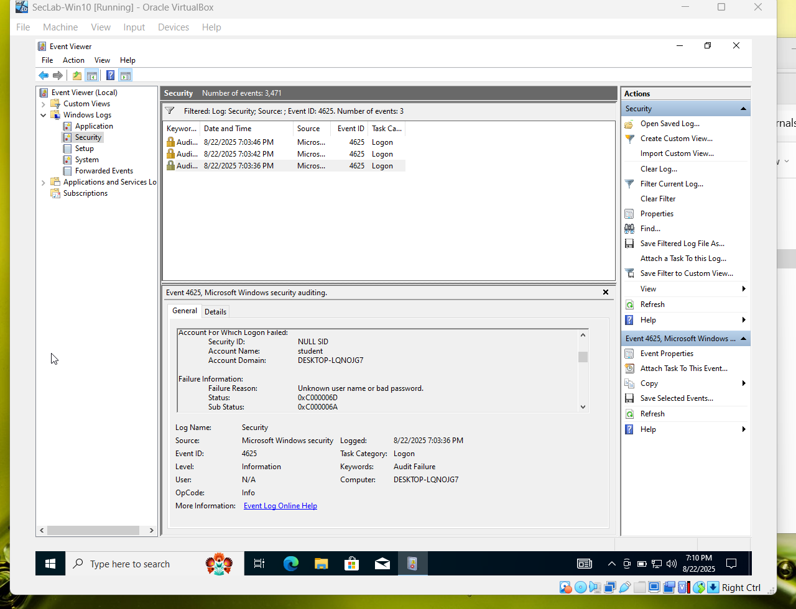
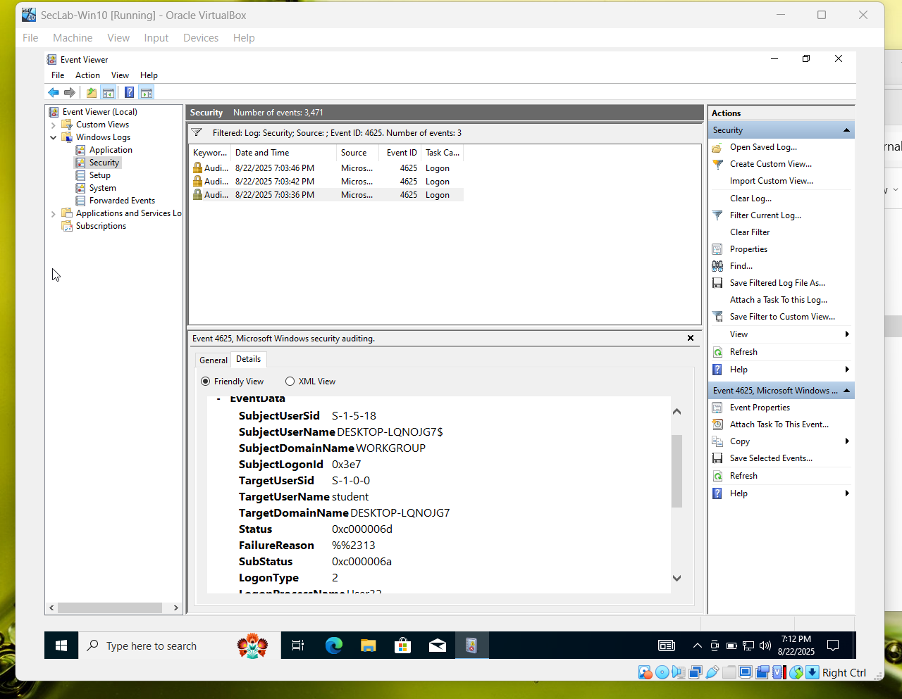
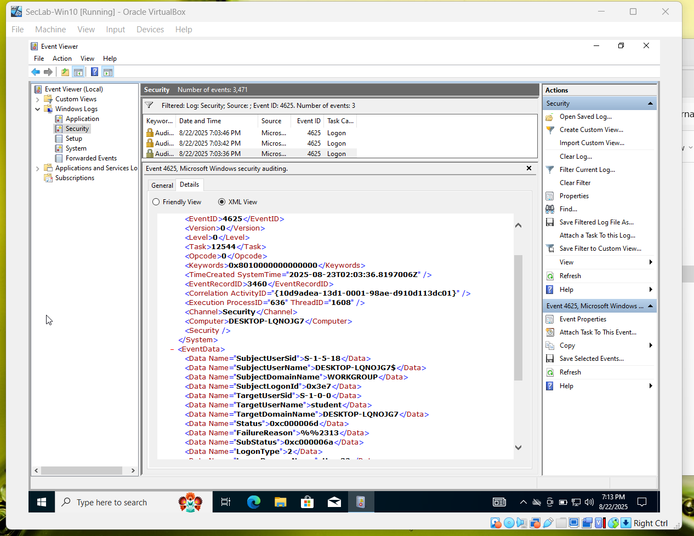

# Lab Setup - Section 3 - Windows Internals for Security Pros
This lab was performed in my Windows 10 VM. I enabled auditing, generated failed logon attempts, and inspected the resulting events in Event Viewer.

--

## Enable Auditing
I opened **Local Security Policy** (secpol.msc), navigated to Advanced Audit Policy Configuration -> Logon/Logoff, and enabled both **Success** and **Failure** for **Audit Logon**.

---

## Generate Failed Logons
I locked the VM and entered the wrong password three times in a row. This created multiple failed logon events (Event ID 4625) in the Security log.

--

## Filter Security Log for Event ID 4625
I Opened Event Viewer (eventvwr.msc), navigated to Windows Logs -> Security, and used **Filter Current Log** to filer for **Event ID 4625**

## View Filtered Results
After applying the filter, I saw the three failed logon events listen in the middle pane of Event Viewer.

## Inspect Event Details (General Tab)
I selected one failed logon event (4625) and looked at the **General** tab. The failure reason, account for which logon failed, and logon type were all displayed.

## Inspect Event Details (Friendly View)
I switched to the **Details** tab and chose **Friendly View** to see structured fields such as Subject, LogonType, and Account information.

## Inspect Event Details (XML View)
I also viewed the **XML View** of the same event to see the raw XML data fields.

--

## Results
By the end of this lab, I had successfully enabled auditing, triggered failed logon events, and confirmed their appearance in Event Viewer.