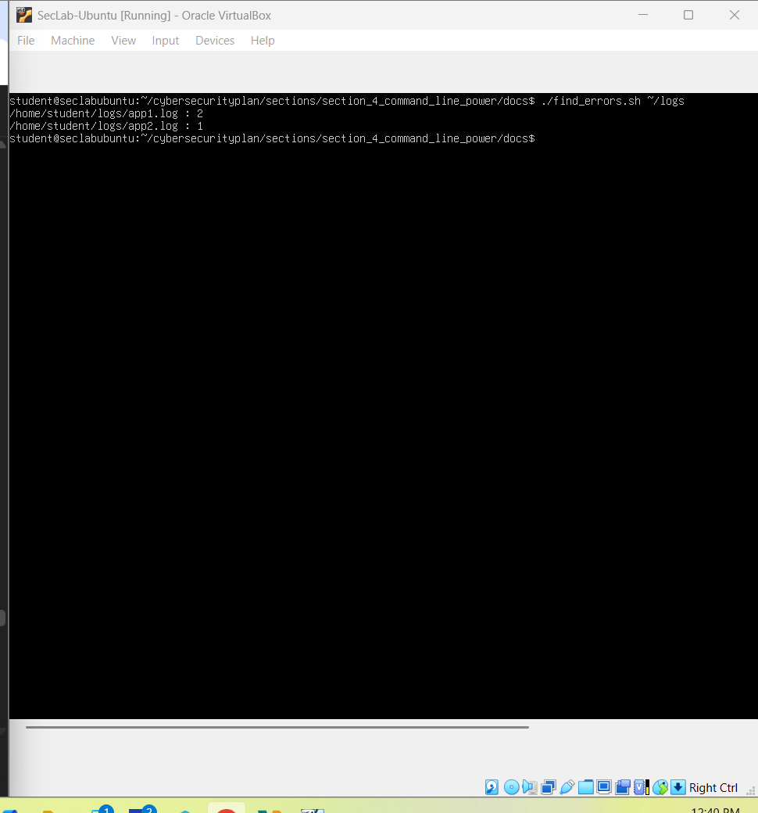

# Lab Setup – Section 4

For this section, I focused on comparing Bash and PowerShell scripting by solving a simple, consistent problem across both platforms.

## Ubuntu Work
I began by creating two `.log` files under `~/logs` that contained a mix of INFO, WARN, and ERROR entries. These files served as controlled test data.  
  
  
  

I then wrote `find_errors.sh` inside the section’s `docs/` directory. The script accepted an optional log directory and pattern, defaulting to `~/logs` and `ERROR|WARN`. It looped through each log file, ran `grep` with extended regex, and returned counts per file.  
  
  

To ensure quality, I used ShellCheck. It confirmed the script followed best practices without errors.  
  

## Windows Work
I mirrored the same log file creation on Windows in `C:\Logs`.  
  
  
  

I then created `Find-Errors.ps1` in the section’s `docs/` directory. The script used parameters for log directory and pattern, defaulting to `C:\Logs` and `ERROR|WARN`. It listed log files with `Get-ChildItem`, scanned them using `Select-String`, and aggregated results with `Measure-Object`.  
  
  

## Reflections
This exercise highlighted the philosophical differences between Bash and PowerShell:  
- Bash emphasizes text manipulation and chaining external tools.  
- PowerShell leverages object pipelines and cmdlets for structured operations.  

By implementing the same functionality in both shells, I reinforced my ability to adapt to multiple environments and gained deeper insight into scripting best practices.
