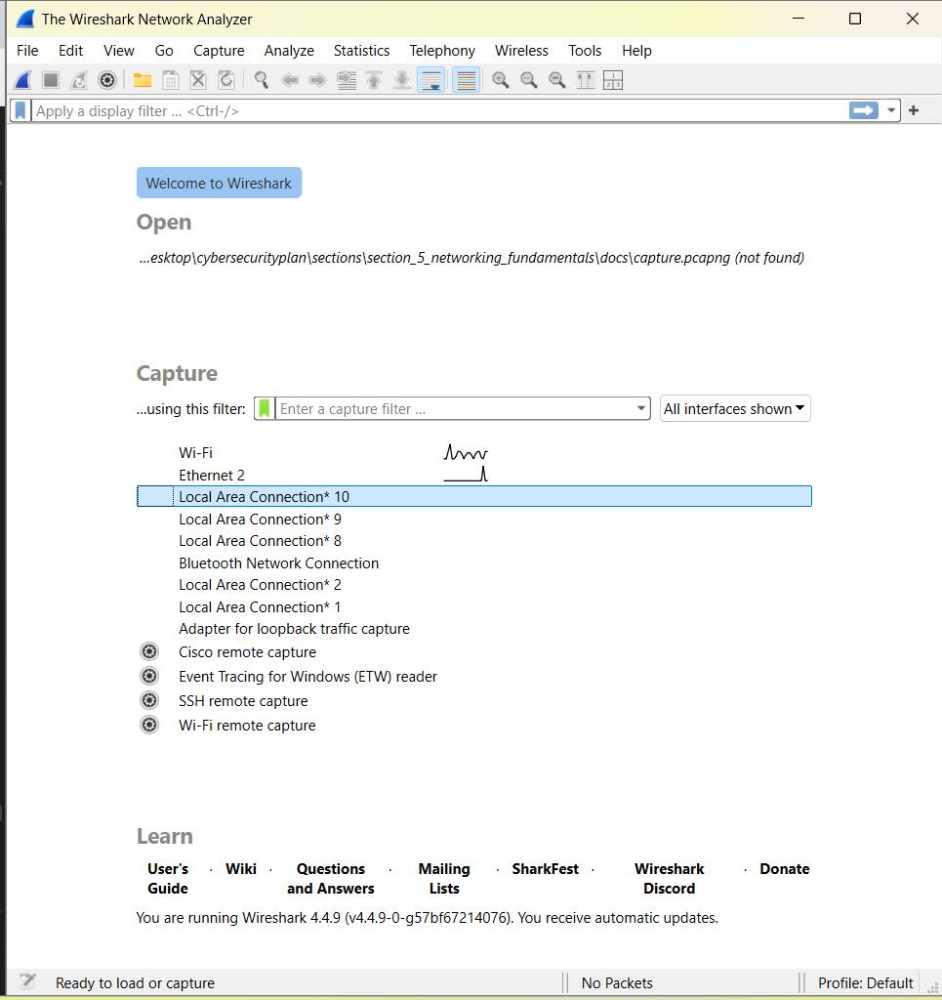
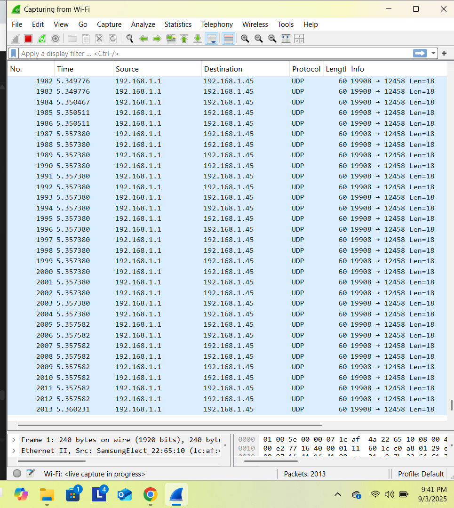
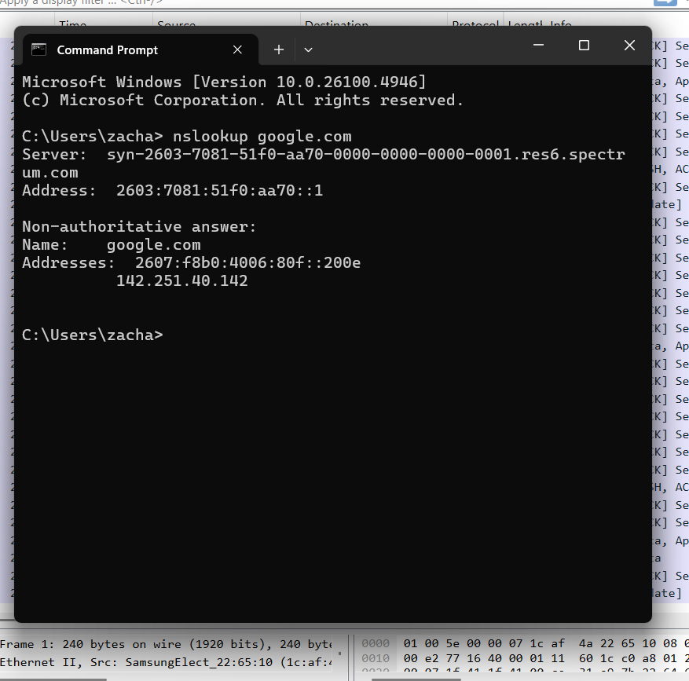
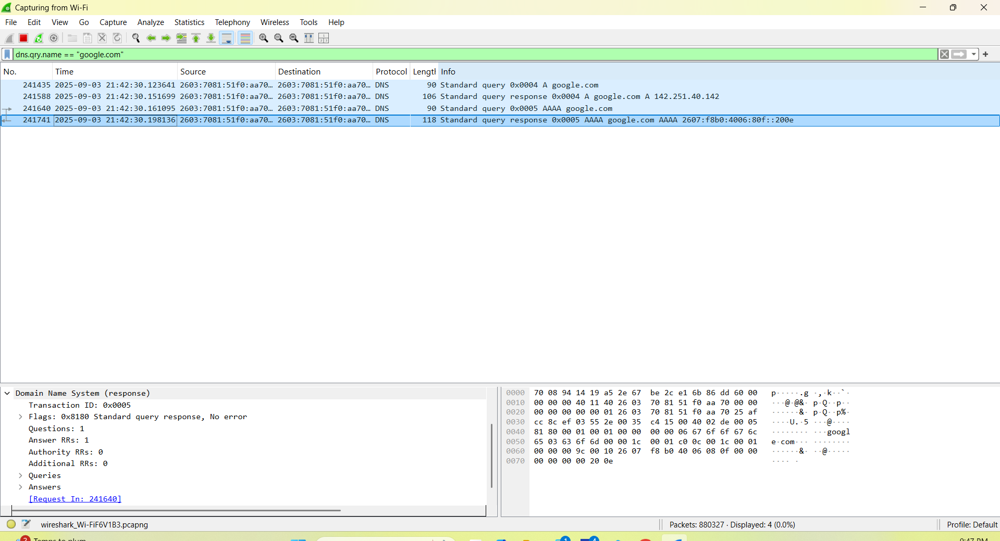
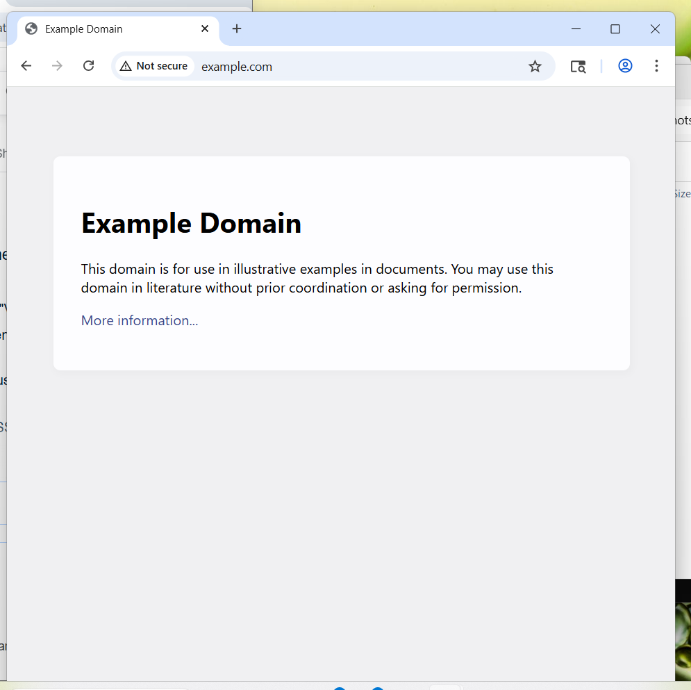
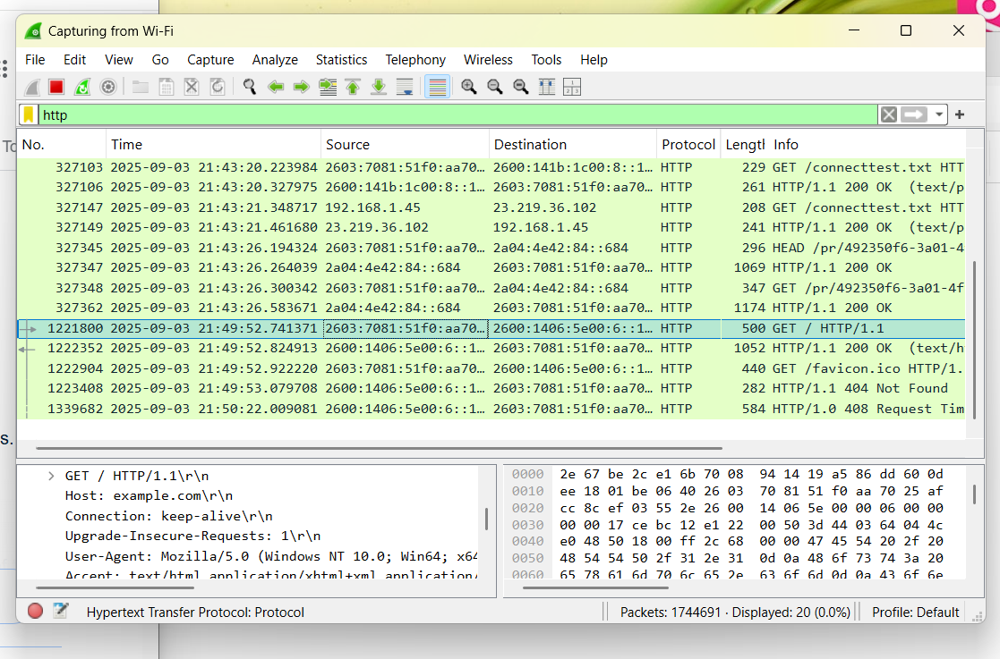

# Section 5 – Networking Fundamentals I: Lab Setup

In this lab, I captured and analyzed DNS and HTTP traffic using Wireshark.

---

## Environment
- Windows 11 Host Machine
- Wireshark installed on host

---

## Process

1. I opened Wireshark and selected my active Wi-Fi interface.  
   

2. I started a live capture and confirmed packets were flowing.  
   

3. I generated DNS traffic using `nslookup google.com` in Command Prompt.  
   

4. I filtered on `dns` to isolate the query and response.  
   

5. I generated HTTP traffic by visiting `http://example.com` in a browser.  
   

6. I filtered on `http` to view the GET request and response.  
   

7. I stopped the capture and saved it as `section5_capture.pcapng`.  
   

---

## Output
- Annotated PCAP: > Raw capture available locally: section5_capture.pcapng (not pushed due to size). 
- PDF Write-up: [capture_writeup.pdf](capture_writeup.pdf)
