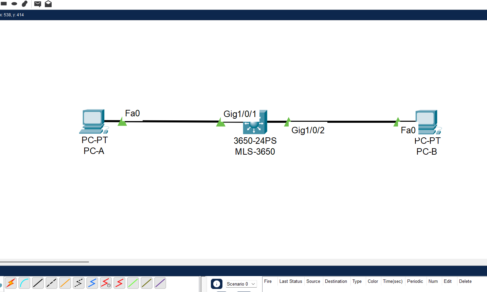
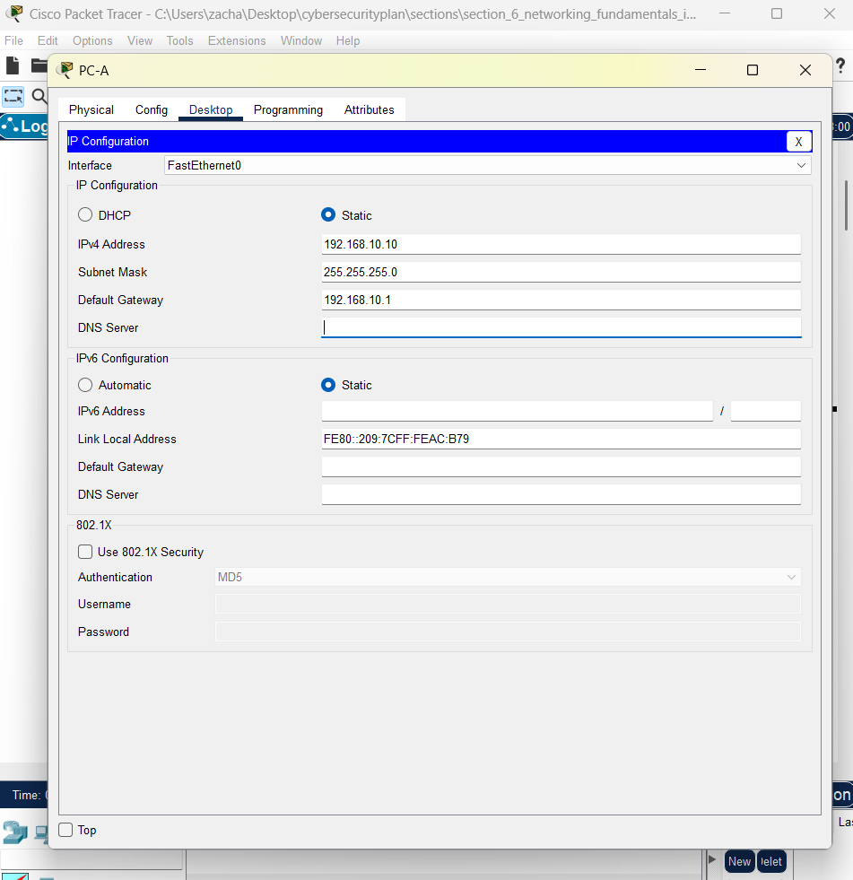
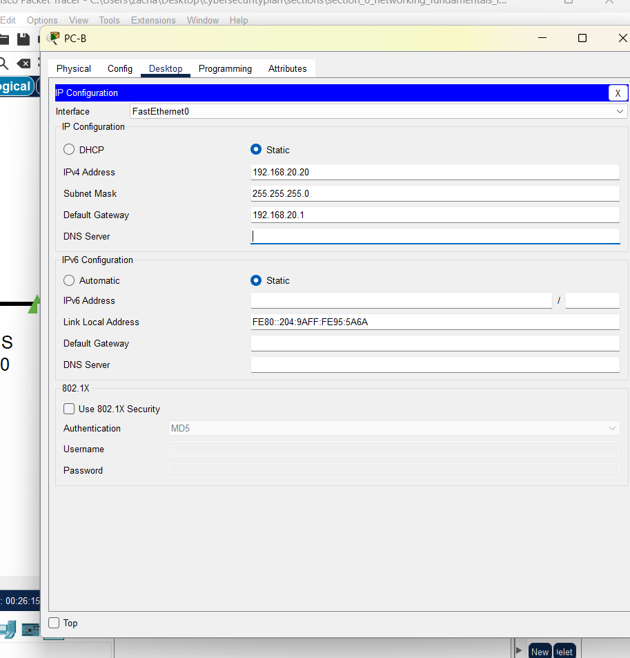
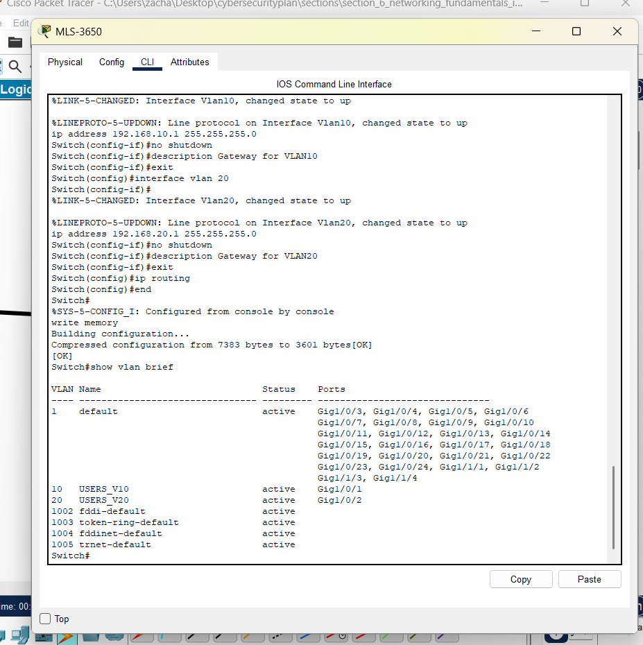
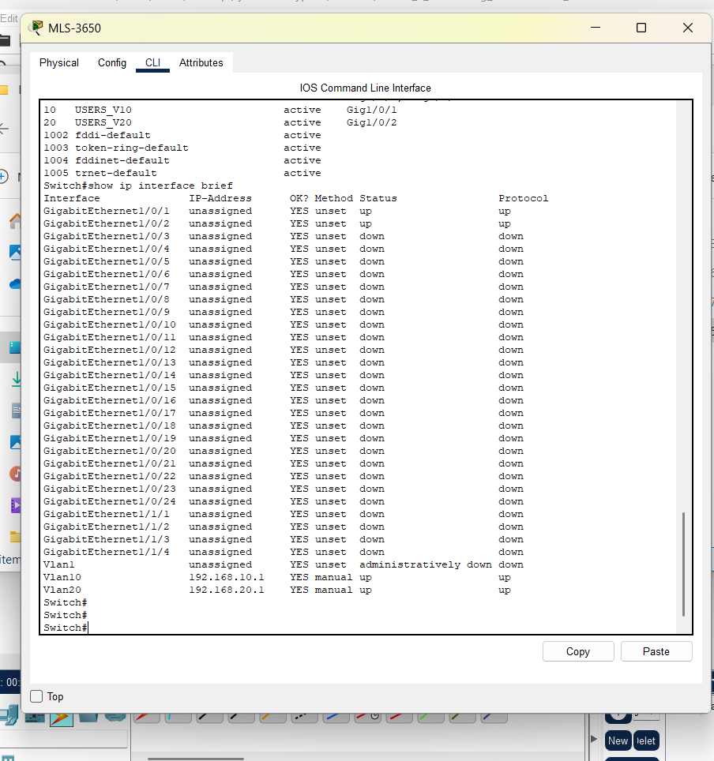
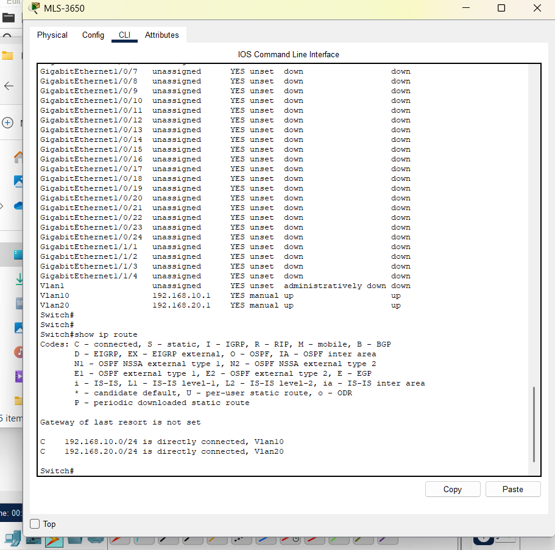
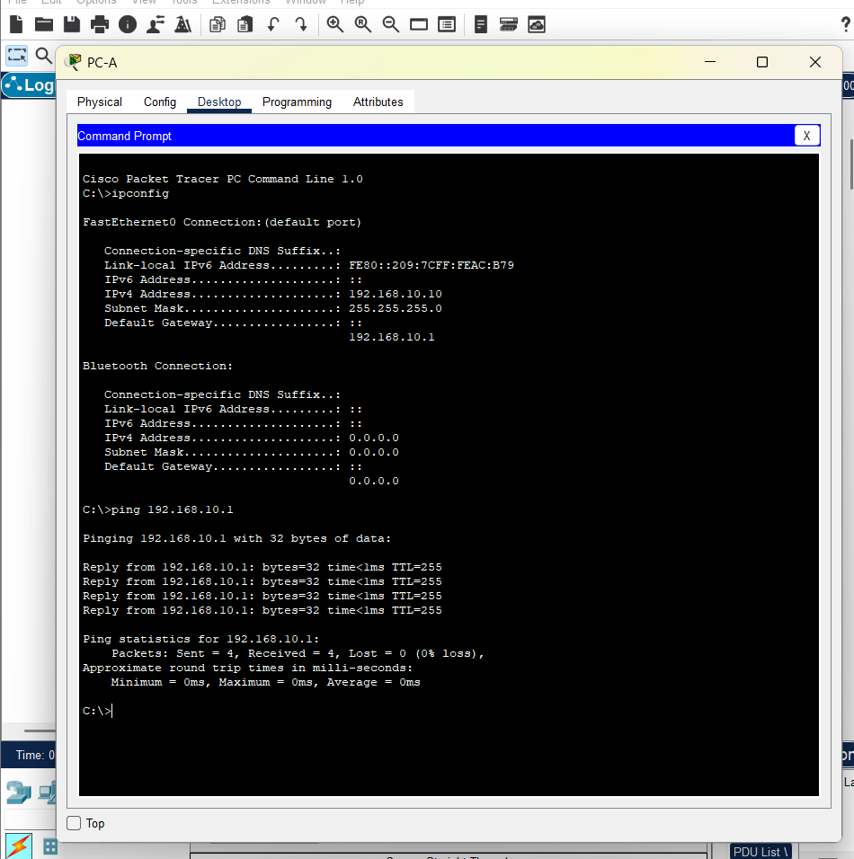
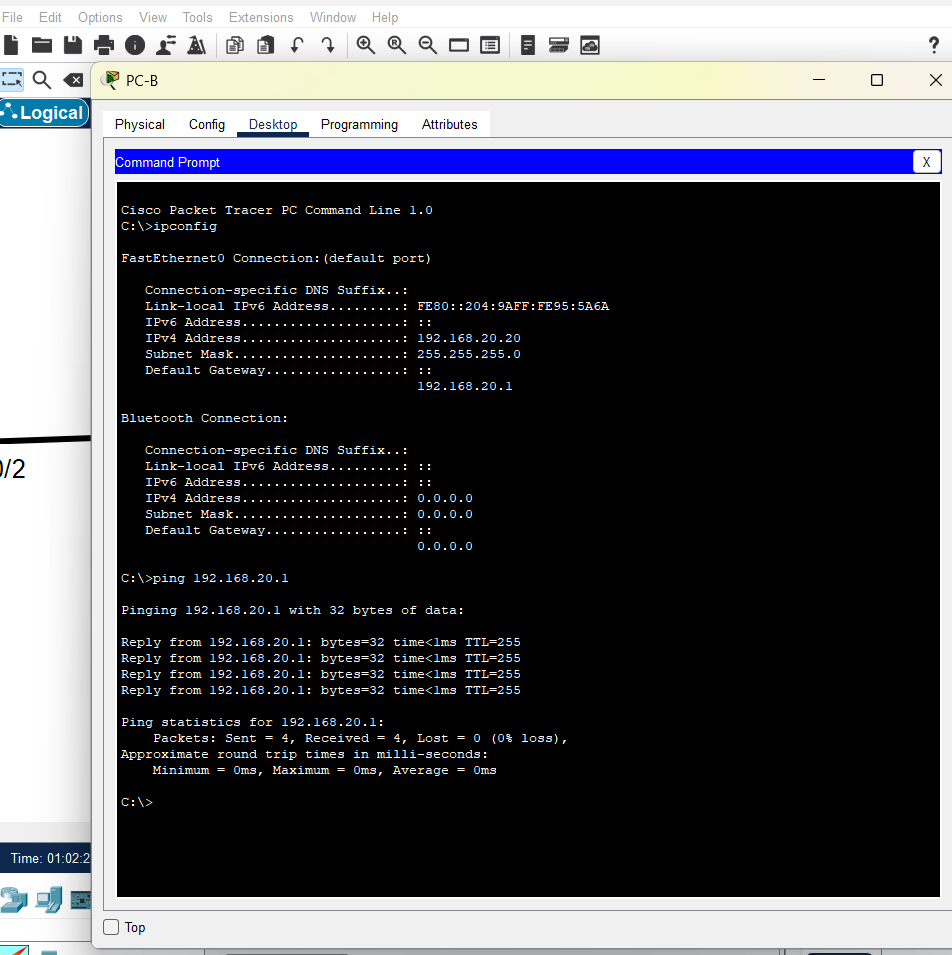
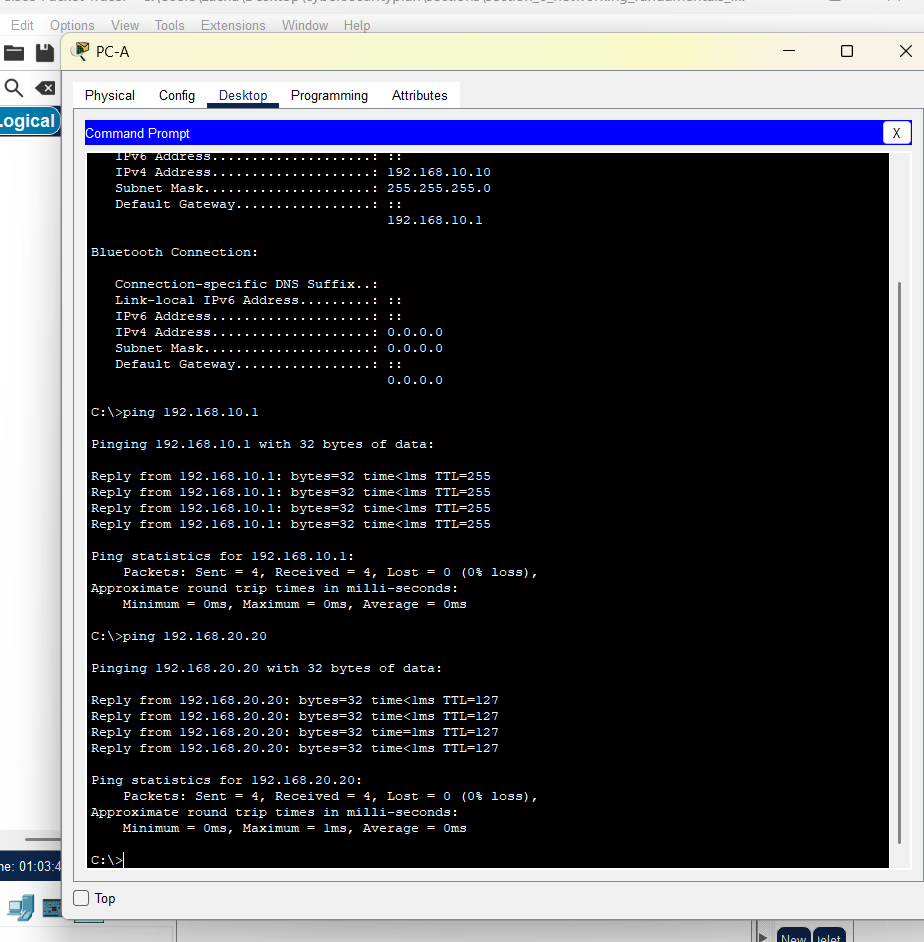
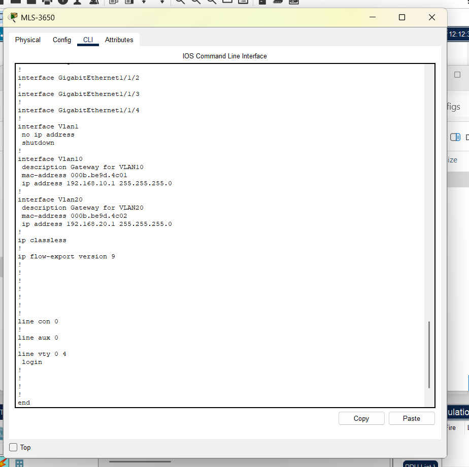

# Lab Setup – Section 6

This lab demonstrates VLANs and inter-VLAN routing on a Cisco 3650 multilayer switch in Packet Tracer.

## Evidence

-   
-   
-   
-   
-   
-   
-   
-   
-   
-   
-   
