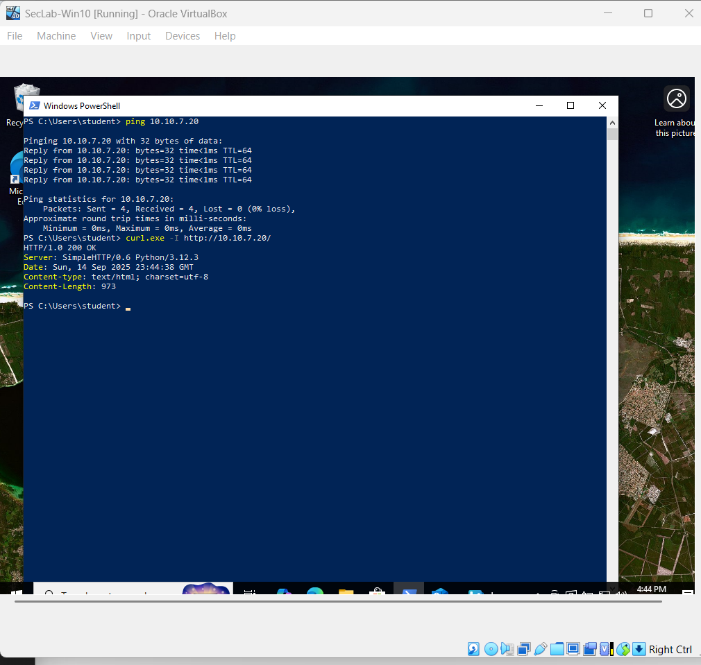

# Lab Setup – Section 7 (Firewalls & ACLs)

This document records exactly how the lab was built and verified. It is not a tutorial, but evidence of the work completed.

---

## Environment
- VirtualBox: each VM has 2 NICs  
  - Adapter 1 = NAT (for updates)  
  - Adapter 2 = Host-only (vboxnet0)  
- Windows 10 client: 10.10.7.10/24  
- Ubuntu Server target: 10.10.7.20/24  
- Test service: Python HTTP server on TCP/80  
- Firewall: nftables with default-deny, specific allows, explicit SSH drop, and logging  

---

## Steps and Evidence

### 1. VM Adapters Confirmed
-   

-   

### 2. Static IPs Assigned
-   

-   

-   

### 3. Baseline Connectivity
-   

### 4. HTTP Service Started
-   

-   

### 5. nftables Service Enabled
-   

### 6. Ruleset Applied
-   

-   

### 7. ACL Behavior Validated
-   

-   

-   

-   

### 8. Rule Order Demo
-   

-   

### 9. Persistence Confirmed
-   
